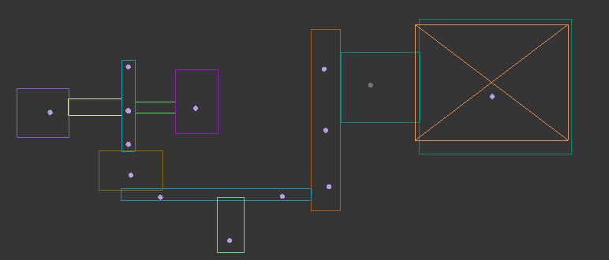
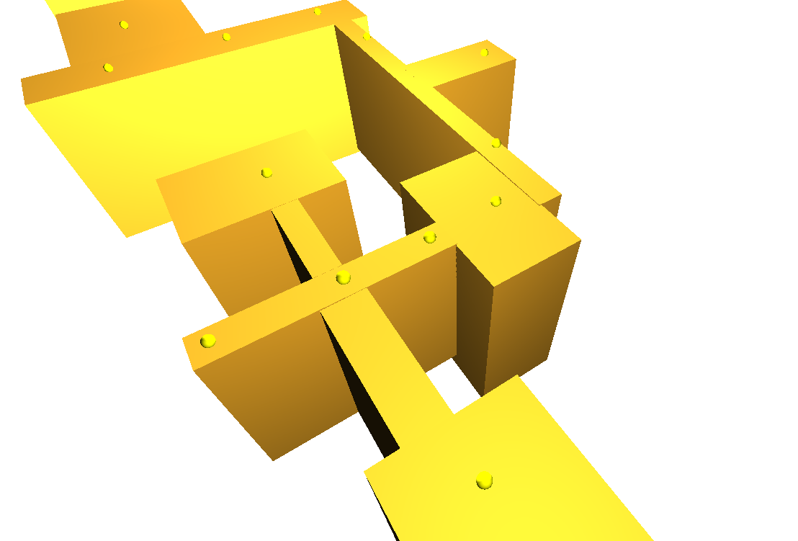
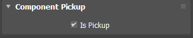
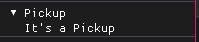
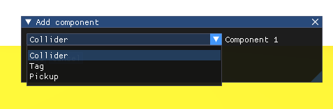
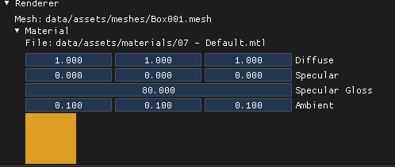
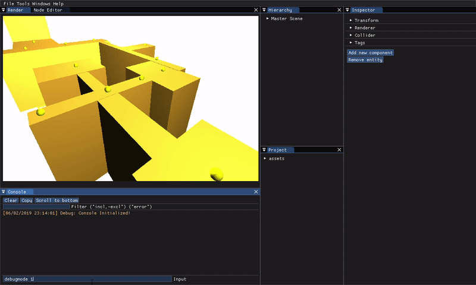
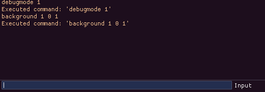
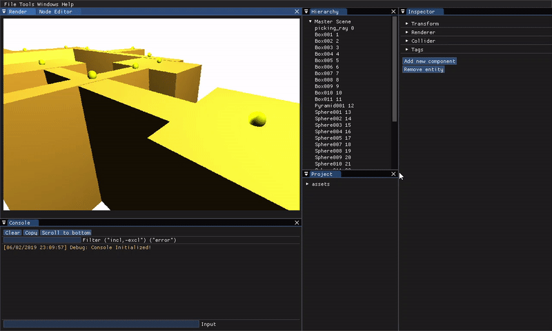

# Final Work

## 1 Design your own level
We created a flat level with some pickups. We supposed that the end  is the main objective.


## 2 Export scene information into the engine using the tools we created.
We created a basic scene with 3DMax and exported to the engine



## 3 Create a new component: **Pickup**
The **pickup** component makes disapear a entity when you pass through it.
Created a new component **Pickup** in 3D Max. 



And we export it properly to our game engine.



We can add this component to any entity.



## 4 Complete the renderer debug menu (material parameters support)
We added all the numeric parameters of a material to the debug menu.



## 5 Add script logic on console editor
We added 2 comands tp the console:
- ```debugmode [1/0] ```: Shows/Hides the debug helps
- ```background [Red] [Green] [Blue]```: Changes the world background color



## 7 Add a button to delete entity
Implemented remove

